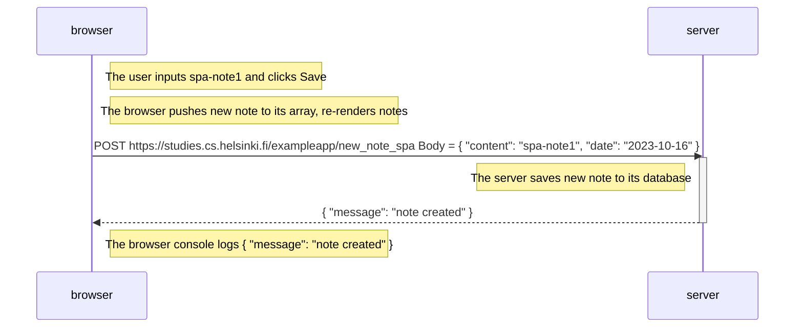

```mermaid
sequenceDiagram
participant browser
participant server

  Note right of browser: The user inputs spa-note1 and clicks Save

  Note right of browser: The browser pushes new note to its array, re-renders notes

  browser->>server: POST https://studies.cs.helsinki.fi/exampleapp/new_note_spa Body = { "content": "spa-note1", "date": "2023-10-16" }
  activate server
  Note left of server: The server saves new note to its database
  server-->>browser: { "message": "note created" }
  deactivate server

  Note right of browser: The browser console logs { "message": "note created" }
```
